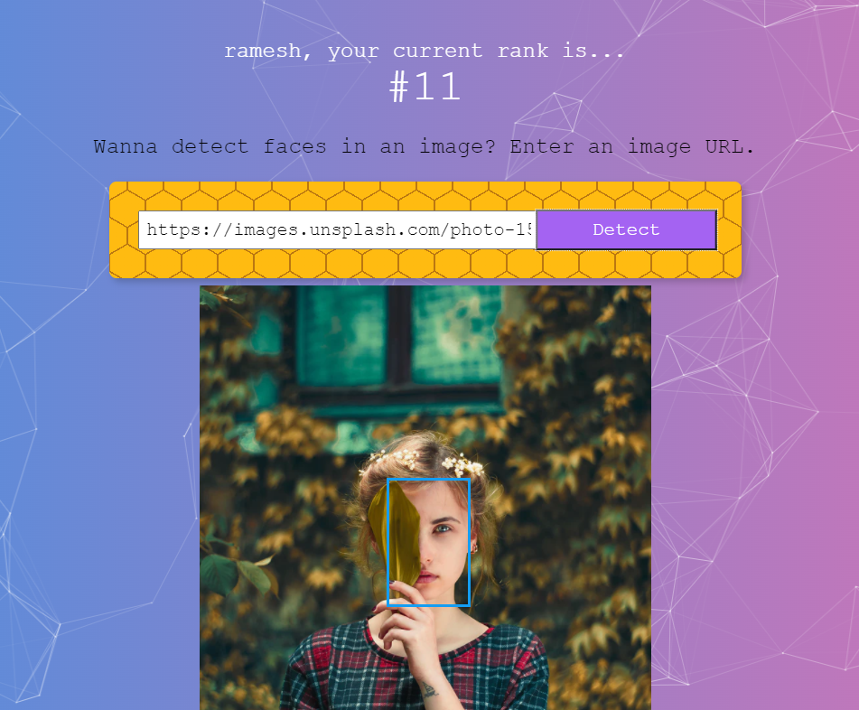

A fullstack application that detects faces in an image and ranks users based on the number of scans.

[Click here](https://facerecognition-frontend-app.herokuapp.com/) to view it in browser.

## Technologies used

- React
- PostgreSQL
- Node.js
- Express.js
- Clarifai API
- tachyons
- Heroku

## Screenshots

| Sign In  | Detection |
| ------------- | ------------- |
|   |   |
